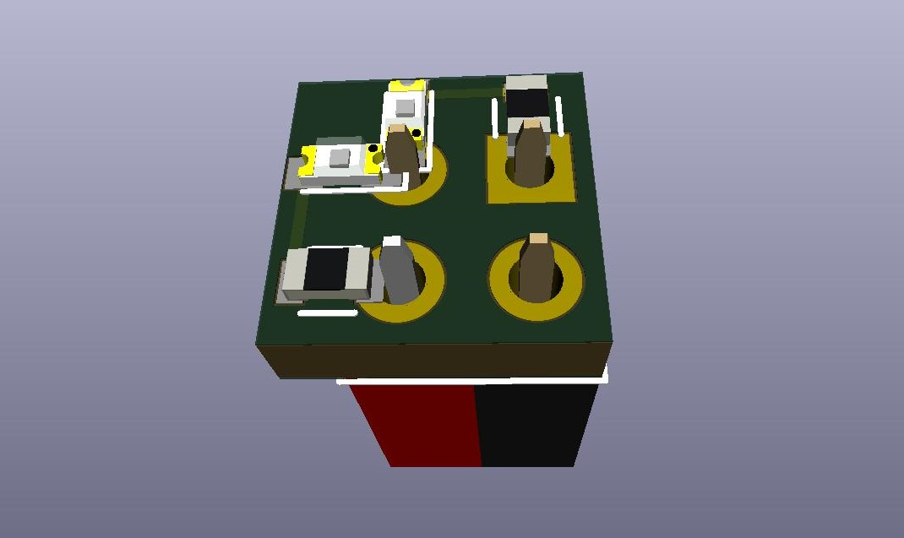
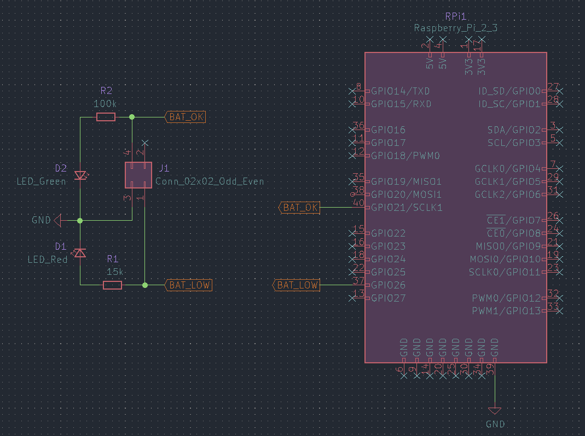
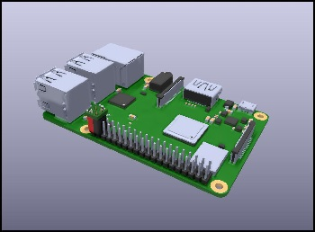
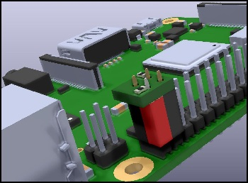

# GPIO Battery Status LEDs


A little circuit board with red and green LEDs that plugs directly into a GPIO
header to indicate a status. The associated software reads a battery voltage
from an I2C/SMbus ADC and switches between the green to red LED when the voltage
crosses a specified threshold.

<!-- TOC depthFrom:2 depthTo:6 withLinks:1 updateOnSave:0 orderedList:0 -->

-   [Hardware](#hardware)
-   [Software](#software)
    -   [Installation](#installation)
    -   [Battery Monitor](#battery-monitor)
        -   [check_battery.py](#checkbatterypy)
        -   [robot-dog-battery-check.service](#robot-dog-battery-checkservice)
    -   [Robot Dog](#robot-dog)
        -   [robot-dog-server.service](#robot-dog-serverservice)
-   [Links](#links)

<!-- /TOC -->

The _battery_check.py_ script can be run standalone, but the _systemd_ service
files in this repository are aimed at a
[Freenove Robot Dog][Freenove Robot Dog Site] so they will need to be modified
if using the script in a different scenario.

The circuit board is usable as a general GPIO status indicator and it's not too
hard to modify the _systemd_ files, or create new _systemd_ files, to adapt for
an arbitrary use.

## Hardware
It's just a couple of LEDs with current limiting resistors stuck on the end of
a 2x2 pin socket.



One of the pin sockets is red, to aid alignment when attaching to the GPIO. It
fits nicely on pins 37-40 on a Raspberry Pi GPIO header, but will work anywhere
there's a pair of GPIO pins adjacent to a ground pin.

[](images/GPIO_LEDs_installed_front_side.jpg)
[](images/GPIO_LEDs_installed_back_side-close.jpg)

## Software
### Installation
The _install.sh_ script is specific to the Freenvove Robot dog, installing
_systemd_ unit files for both the battery monitoring service and the server
software that allows control of the robot.

Usage:
```sh
sudo ./install.sh (<path_to_freenove_software>)
```

The directory the script is executed from will be used as the path for the
Freenove software if none is provided as an argument.

The _install.sh_ script can be used as a guide for manual installation, if the
application isn't a robot dog or some components aren't desired for whatever
reason.

### Battery Monitor
#### check_battery.py
The _check_battery.py_ script simply runs a loop, reading ADC data on a delay
(5 seconds by default) and comparing it against a threshold value, then toggles
the LEDs when the threshold is crossed. As is, the script will enable the green
LED when the battery voltage is above the threshold (i.e charged) and switch to
the red LED when the battery voltage is below the threshold (i.e. low capacity).

Usage:
```sh
./check_battery.py
```

By default the script looks for an ADS7830 ADC at address _0x48_ on _SMBus 1_.

Variables, including the specific GPIO pins to use and the addressing of the
ADC, are defined at the top of the script and are easily changed. A class for a
different ADC shouldn't be hard to add.

The units (volts) are only present in the log output and don't impact data
processing, so it's just a matter of changing some log message strings to
display the right units if monitoring something other than voltage.

#### robot-dog-battery-check.service
The _robot-dog-battery-check.service_ systemd unit file will start the battery
monitor, however it is configured for the Freenove robot dog and is thus tied
to the _robot-dog-server.service_. The unit file will work standalone if the
```BindsTo=``` and ```After=``` lines are removed.

Bound to the robot dog control server as it is, the _check_battery.py_ service
won't start until the control software is started and will stop if the control
software is stopped. This provides a third LED state, with both LEDs off being
an indication that the robot dog is not ready to be controlled.

### Robot Dog
#### robot-dog-server.service
The Freenove robot dog comes with instructions to start the server inside a GUI,
after the GUI is up. If we choose to start the control software in _systemd_,
instead of during the desktop GUI's initialisation, we have the option of
disabling the GUI entirely and saving some resources and maybe improving battery
life.

The _robot-dog-server.service_ needs to be modified to add the path to the
Freenove software, although this will be done automatically if using
_install.sh_ to install everything.

## Links
### Freenove Robot Dog
*   [Freenove][Freenove Robot Dog Site]
*   [Github][Freenove Robot Dog Github]

### Datasheets
*   [ADS7830](https://www.ti.com/lit/gpn/ADS7830)

[Freenove Robot Dog Site]: https://store.freenove.com/products/fnk0050
[Freenove Robot Dog Github]: https://github.com/Freenove/Freenove_Robot_Dog_Kit_for_Raspberry_Pi
